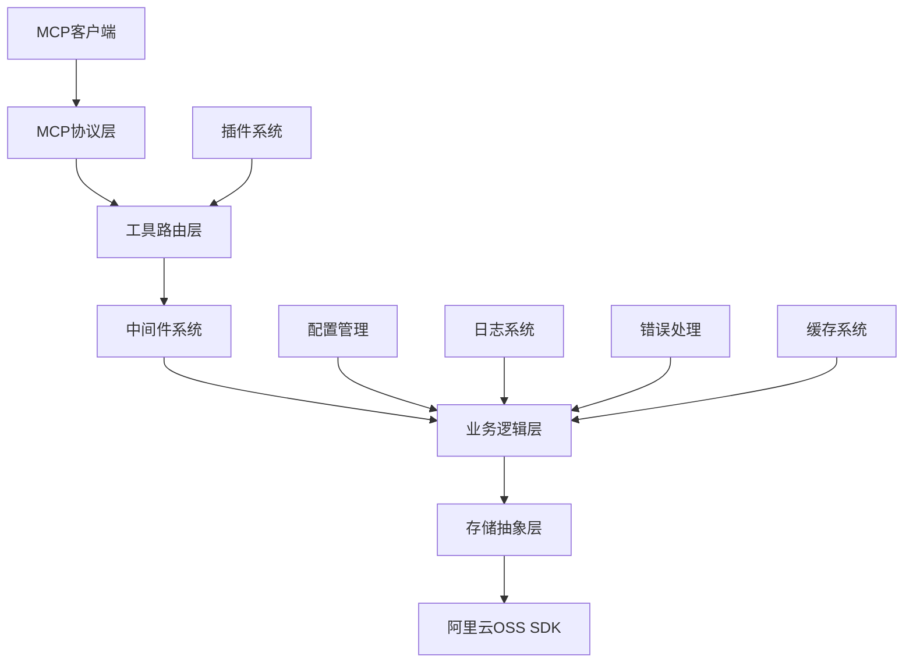

# 阿里云OSS MCP服务架构设计文档

## 📋 文档信息

- **项目名称**: aigroup-aliyunoss-mcp
- **版本**: 1.0.0
- **创建日期**: 2025-08-18
- **文档类型**: 系统架构设计
- **目标受众**: 开发人员、架构师、运维人员

## 🎯 项目概述

### 项目背景

本项目旨在为阿里云OSS (Object Storage Service) 创建一个基于stdio协议的MCP (Model Context Protocol) 服务器，提供完整的云存储操作功能，支持通过npx安装和运行。

### 核心目标

1. **完整性**: 暴露阿里云OSS的全部核心功能
2. **易用性**: 支持npx一键安装和运行
3. **可靠性**: 完善的错误处理和日志记录
4. **扩展性**: 支持插件系统和多存储后端
5. **安全性**: 严格的权限控制和数据保护

### 功能范围

- ✅ 文件上传/下载/删除
- ✅ 文件列表和元数据管理
- ✅ 临时签名URL生成
- ✅ 文件权限控制
- ✅ 分片上传支持
- ✅ 批量操作
- ✅ 健康检查和监控

## 🏗️ 系统架构总览

### 架构模式

本项目采用**分层架构**和**插件化架构**相结合的设计模式：



### 技术栈

- **运行时**: Node.js 18+
- **语言**: TypeScript 5.2+
- **MCP SDK**: @modelcontextprotocol/sdk
- **存储SDK**: ali-oss 6.18+
- **日志**: winston 3.11+
- **验证**: zod 3.22+
- **构建工具**: tsc, jest

## 📁 项目目录结构

```
aigroup-aliyunoss-mcp/
├── package.json              # npm包配置和脚本
├── tsconfig.json            # TypeScript编译配置
├── README.md                # 项目说明文档
├── ARCHITECTURE.md          # 架构设计文档
├── LICENSE                  # 开源协议
├── .gitignore              # Git忽略规则
├── .npmignore              # npm发布忽略规则
├── .env.example            # 环境变量示例
├── src/
│   ├── index.ts            # 应用程序入口点
│   ├── server.ts           # MCP服务器核心逻辑
│   ├── tools/              # MCP工具实现
│   │   ├── upload.ts       # 文件上传工具
│   │   ├── download.ts     # 文件下载工具
│   │   ├── delete.ts       # 文件删除工具
│   │   ├── list.ts         # 文件列表工具
│   │   ├── copy.ts         # 文件复制工具
│   │   ├── meta.ts         # 文件元数据工具
│   │   ├── url.ts          # 签名URL工具
│   │   ├── acl.ts          # 权限管理工具
│   │   ├── multipart.ts    # 分片上传工具
│   │   └── index.ts        # 工具统一导出
│   ├── services/           # 业务服务层
│   │   ├── oss.ts          # OSS服务封装
│   │   ├── config.ts       # 配置管理服务
│   │   └── validator.ts    # 参数验证服务
│   ├── core/               # 核心系统组件
│   │   ├── plugin-manager.ts      # 插件管理器
│   │   ├── event-bus.ts           # 事件总线
│   │   ├── middleware.ts          # 中间件系统
│   │   ├── cache-manager.ts       # 缓存管理器
│   │   ├── config-watcher.ts      # 配置监听器
│   │   └── storage-manager.ts     # 存储后端管理器
│   ├── types/              # TypeScript类型定义
│   │   ├── index.ts        # 通用类型定义
│   │   ├── tools.ts        # 工具接口类型
│   │   ├── config.ts       # 配置接口类型
│   │   ├── plugin.ts       # 插件接口类型
│   │   └── storage.ts      # 存储接口类型
│   └── utils/              # 工具函数库
│       ├── logger.ts       # 日志记录工具
│       ├── errors.ts       # 错误处理工具
│       ├── validation.ts   # 参数验证工具
│       ├── health-check.ts # 健康检查工具
│       └── error-handler.ts # 错误处理中间件
├── tests/                  # 测试文件目录
├── build/                  # TypeScript编译输出
├── coverage/               # 测试覆盖率报告
├── examples/               # 使用示例和配置
│   ├── basic-usage.md      # 基础使用示例
│   ├── mcp-config.json     # MCP配置示例
│   └── plugins/            # 插件示例
└── scripts/                # 构建和发布脚本
    ├── post-build.js       # 构建后处理
    ├── release.js          # 发布脚本
    └── verify-install.js   # 安装验证脚本
```

## 🔧 核心组件设计

### 1. MCP服务器核心 (`src/server.ts`)

MCP服务器是整个系统的核心，负责：

- MCP协议实现和消息处理
- 工具注册和路由分发
- 中间件链执行
- 错误处理和响应格式化

```typescript
interface McpServerCore {
  // 服务器生命周期
  initialize(): Promise<void>;
  start(): Promise<void>;
  stop(): Promise<void>;
  
  // 工具管理
  registerTool(tool: ToolDefinition): void;
  unregisterTool(toolName: string): void;
  
  // 中间件管理
  use(middleware: MiddlewareDefinition): void;
  
  // 健康检查
  getHealthStatus(): Promise<HealthStatus>;
}
```

### 2. 工具系统 (`src/tools/`)

每个OSS功能都对应一个MCP工具，支持：

- 统一的参数验证
- 错误处理和重试机制
- 性能监控和日志记录
- 插件扩展点

#### 核心工具列表

| 工具名称 | 功能描述 | 输入参数 | 输出格式 |
|---------|---------|---------|---------|
| `uploadFile` | 文件上传 | fileName, file, contentType | fileName, url, size, etag |
| `downloadFile` | 文件下载 | fileName, localPath | localPath, size, success |
| `deleteObject` | 文件删除 | fileName | fileName, success |
| `listObjects` | 文件列表 | prefix, maxKeys, marker | objects[], nextMarker, isTruncated |
| `getObjectUrl` | 签名URL | fileName, expires, method | url, expires, fileName |
| `copyObject` | 文件复制 | source, target, metadata | source, target, success |
| `putObjectACL` | 设置权限 | fileName, acl | fileName, acl, success |
| `getObjectACL` | 获取权限 | fileName | fileName, acl, owner |
| `getObjectMeta` | 获取元数据 | fileName | fileName, size, lastModified, contentType |
| `multipartUpload` | 分片上传 | fileName, filePath, partSize | fileName, location, size, parts |

### 3. 配置管理系统 (`src/services/config.ts`)

支持多层级配置管理：

```typescript
interface ConfigManager {
  // 配置加载和验证
  loadConfig(): AppConfig;
  validateConfig(): void;
  
  // 配置访问
  getOSSConfig(): OSSConfig;
  getMCPConfig(): MCPConfig;
  getMultipartConfig(): MultipartConfig;
  
  // 配置更新
  updateConfig(updates: Partial<AppConfig>): void;
  
  // 配置监控
  getConfigSummary(): Record<string, any>;
}
```

**配置优先级**:
1. 系统环境变量（最高）
2. `.env` 文件
3. 代码默认值（最低）

### 4. 错误处理系统 (`src/utils/errors.ts`)

分层错误处理架构：

```typescript
enum ErrorCode {
  // 配置错误
  CONFIG_INVALID = 'CONFIG_INVALID',
  CONFIG_MISSING = 'CONFIG_MISSING',
  
  // OSS服务错误
  OSS_CONNECTION_ERROR = 'OSS_CONNECTION_ERROR',
  OSS_AUTHENTICATION_ERROR = 'OSS_AUTHENTICATION_ERROR',
  OSS_PERMISSION_ERROR = 'OSS_PERMISSION_ERROR',
  OSS_TIMEOUT_ERROR = 'OSS_TIMEOUT_ERROR',
  
  // 文件操作错误
  FILE_NOT_FOUND = 'FILE_NOT_FOUND',
  FILE_TOO_LARGE = 'FILE_TOO_LARGE',
  FILE_TYPE_NOT_ALLOWED = 'FILE_TYPE_NOT_ALLOWED',
  
  // MCP协议错误
  MCP_INVALID_REQUEST = 'MCP_INVALID_REQUEST',
  MCP_TOOL_NOT_FOUND = 'MCP_TOOL_NOT_FOUND',
  MCP_PARAMETER_INVALID = 'MCP_PARAMETER_INVALID'
}
```

### 5. 日志记录系统 (`src/utils/logger.ts`)

结构化日志记录：

- **多级别日志**: debug, info, warn, error
- **上下文信息**: traceId, operation, duration
- **专用日志类型**: 性能监控、审计日志、安全事件
- **输出到stderr**: 与MCP消息分离

## 🔌 扩展性架构

### 1. 插件系统

支持动态加载和热插拔的插件架构：

```typescript
interface Plugin {
  metadata: PluginMetadata;
  
  // 生命周期钩子
  onLoad?(context: PluginContext): Promise<void>;
  onUnload?(context: PluginContext): Promise<void>;
  onConfigChange?(newConfig: AppConfig): Promise<void>;
  
  // 功能扩展
  getTools?(): ToolDefinition[];
  getMiddlewares?(): MiddlewareDefinition[];
  getEventListeners?(): EventListenerDefinition[];
}
```

### 2. 中间件系统

可组合的中间件链，支持：

- **请求/响应拦截**
- **参数验证**
- **性能监控**
- **访问控制**
- **缓存管理**

### 3. 事件系统

松耦合的事件驱动架构：

```typescript
interface EventBus {
  on(event: string, handler: EventHandler): void;
  off(event: string, handler: EventHandler): void;
  emit(event: string, data?: any): Promise<void>;
  once(event: string, handler: EventHandler): void;
}
```

**核心事件**:
- `plugin:loaded` - 插件加载完成
- `plugin:unloaded` - 插件卸载完成
- `config:changed` - 配置发生变更
- `tool:called` - 工具被调用
- `error:occurred` - 错误发生

### 4. 多存储后端支持

抽象存储接口，支持多种云存储：

```typescript
interface StorageBackend {
  name: string;
  uploadFile(content: Buffer, fileName: string): Promise<UploadResult>;
  downloadFile(fileName: string): Promise<Buffer>;
  deleteFile(fileName: string): Promise<void>;
  listFiles(options?: ListOptions): Promise<FileInfo[]>;
  generateTempUrl(fileName: string, expires: number): Promise<string>;
}
```

## 🛡️ 安全性考虑

### 1. 凭据管理

- 环境变量存储敏感信息
- 配置文件中敏感数据掩码
- 支持外部密钥管理系统

### 2. 访问控制

- 文件路径验证，防止目录遍历
- 文件类型白名单限制
- 文件大小限制
- 操作权限检查

### 3. 数据保护

- 传输过程加密 (HTTPS)
- 临时URL有效期控制
- 敏感日志信息过滤
- 错误信息脱敏

### 4. 安全审计

- 操作审计日志
- 异常行为监控
- 访问频率限制
- 安全事件告警

## ⚡ 性能优化

### 1. 缓存策略

- **文件元数据缓存**: 减少OSS API调用
- **临时URL缓存**: 避免重复生成
- **配置缓存**: 减少文件读取
- **LRU淘汰策略**: 内存使用控制

### 2. 连接优化

- **连接池管理**: 复用HTTP连接
- **超时配置**: 合理的超时设置
- **重试机制**: 指数退避重试
- **并发控制**: 限制并发请求数

### 3. 分片上传优化

- **自适应分片大小**: 根据文件大小调整
- **并行上传**: 多分片并行处理
- **断点续传**: 支持上传恢复
- **进度监控**: 实时上传进度

### 4. 内存管理

- **流式处理**: 大文件流式传输
- **内存监控**: 实时内存使用监控
- **垃圾回收**: 及时释放内存
- **内存泄漏检测**: 定期检查

## 🔍 监控和诊断

### 1. 健康检查

```typescript
interface HealthStatus {
  status: 'healthy' | 'unhealthy' | 'degraded';
  timestamp: string;
  version: string;
  uptime: number;
  checks: {
    config: HealthCheckResult;
    oss: HealthCheckResult;
    memory: HealthCheckResult;
  };
}
```

### 2. 性能指标

- **响应时间**: 工具调用耗时统计
- **吞吐量**: 文件传输速率监控
- **错误率**: 操作失败率统计
- **资源使用**: CPU、内存使用率

### 3. 可观测性

- **分布式追踪**: traceId贯穿请求链路
- **结构化日志**: JSON格式便于分析
- **指标收集**: Prometheus兼容格式
- **告警机制**: 异常情况自动告警

## 📦 部署架构

### 1. npm包发布

```json
{
  "name": "aigroup-aliyunoss-mcp",
  "version": "1.0.0",
  "bin": {
    "aigroup-aliyunoss-mcp": "build/index.js"
  },
  "files": [
    "build/**/*",
    "README.md",
    "LICENSE",
    "examples/**/*"
  ]
}
```

### 2. 安装方式

```bash
# 全局安装
npm install -g aigroup-aliyunoss-mcp

# 临时运行
npx aigroup-aliyunoss-mcp --stdio

# 项目依赖
npm install aigroup-aliyunoss-mcp
```

### 3. MCP配置

```json
{
  "mcpServers": {
    "aigroup-aliyunoss-mcp": {
      "command": "npx",
      "args": ["aigroup-aliyunoss-mcp", "--stdio"],
      "env": {
        "OSS_ACCESS_KEY_ID": "your_key_id",
        "OSS_ACCESS_KEY_SECRET": "your_key_secret",
        "OSS_BUCKET": "your_bucket",
        "OSS_REGION": "oss-cn-beijing"
      },
      "disabled": false,
      "alwaysAllow": [],
      "disabledTools": []
    }
  }
}
```

### 4. Docker支持

```dockerfile
FROM node:18-alpine
WORKDIR /app
COPY package*.json ./
RUN npm ci --only=production
COPY build/ ./build/
EXPOSE 3000
CMD ["node", "build/index.js", "--stdio"]
```

## 🔄 CI/CD流程

### 1. 持续集成

- **代码检查**: ESLint + Prettier
- **类型检查**: TypeScript编译
- **单元测试**: Jest测试框架
- **覆盖率检查**: 80%+代码覆盖率
- **集成测试**: 真实OSS环境测试

### 2. 持续部署

- **版本管理**: 语义化版本控制
- **包构建**: TypeScript编译打包
- **包验证**: 安装和功能测试
- **包发布**: npm自动发布
- **文档更新**: 自动生成API文档

### 3. 质量保证

- **安全扫描**: npm audit + Snyk
- **性能测试**: 负载和压力测试
- **兼容性测试**: 多Node.js版本
- **用户验收**: 示例项目验证

## 📈 项目里程碑

### Phase 1: 核心功能 (4周)
- [x] 基础MCP服务器框架
- [x] 核心OSS工具实现
- [x] 配置管理系统
- [x] 错误处理机制

### Phase 2: 高级功能 (3周)
- [x] 分片上传支持
- [x] 权限管理工具
- [x] 批量操作功能
- [x] 健康检查系统

### Phase 3: 扩展性 (3周)
- [x] 插件系统架构
- [x] 中间件框架
- [x] 事件驱动架构
- [x] 多存储后端抽象

### Phase 4: 发布准备 (2周)
- [x] npm包配置优化
- [x] CI/CD流程建立
- [x] 文档完善
- [x] 示例和教程

## 🤝 贡献指南

### 1. 开发环境

```bash
# 克隆仓库
git clone https://github.com/your-org/aigroup-aliyunoss-mcp.git
cd aigroup-aliyunoss-mcp

# 安装依赖
npm install

# 配置环境
cp .env.example .env
# 编辑 .env 文件填入OSS配置

# 开发模式
npm run dev
```

### 2. 代码规范

- **TypeScript**: 严格模式开启
- **ESLint**: 代码风格检查
- **Prettier**: 代码格式化
- **Jest**: 单元测试编写

### 3. 提交规范

```bash
# 功能开发
git commit -m "feat: 添加新的工具功能"

# 问题修复
git commit -m "fix: 修复文件上传错误"

# 文档更新
git commit -m "docs: 更新API文档"
```

## 📞 联系和支持

### 项目信息

- **仓库地址**: https://github.com/your-org/aigroup-aliyunoss-mcp
- **文档站点**: https://your-org.github.io/aigroup-aliyunoss-mcp
- **npm包页**: https://www.npmjs.com/package/aigroup-aliyunoss-mcp
- **问题反馈**: https://github.com/your-org/aigroup-aliyunoss-mcp/issues

### 维护团队

- **架构师**: 负责系统设计和技术决策
- **开发工程师**: 负责功能开发和维护
- **测试工程师**: 负责质量保证和测试
- **运维工程师**: 负责部署和监控

---

**文档版本**: v1.0.0  
**最后更新**: 2025-08-18  
**状态**: ✅ 已完成